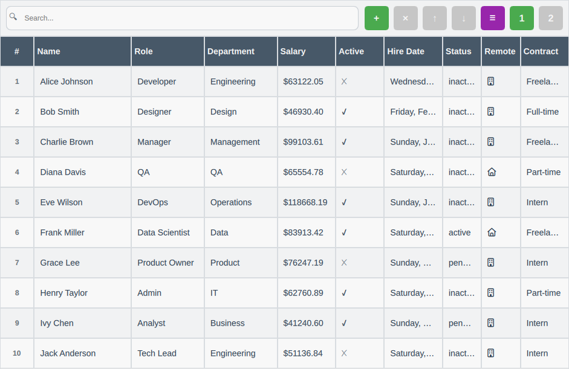

# DataGrid Project

A DataGrid component developed in QML for Qt applications.

## Screenshot

## Description

This project implements a custom DataGrid with modern features for displaying and manipulating tabular data.

**⚠️ Project Status: Under Development**  
This project is currently in active development. Features may be incomplete.

## Features

- Data visualization in table format
- Custom model for data management  
- Proxy model for filtering and sorting
- Interface developed in QML

## Development

Project developed using Qt, QML and C++.C++.
